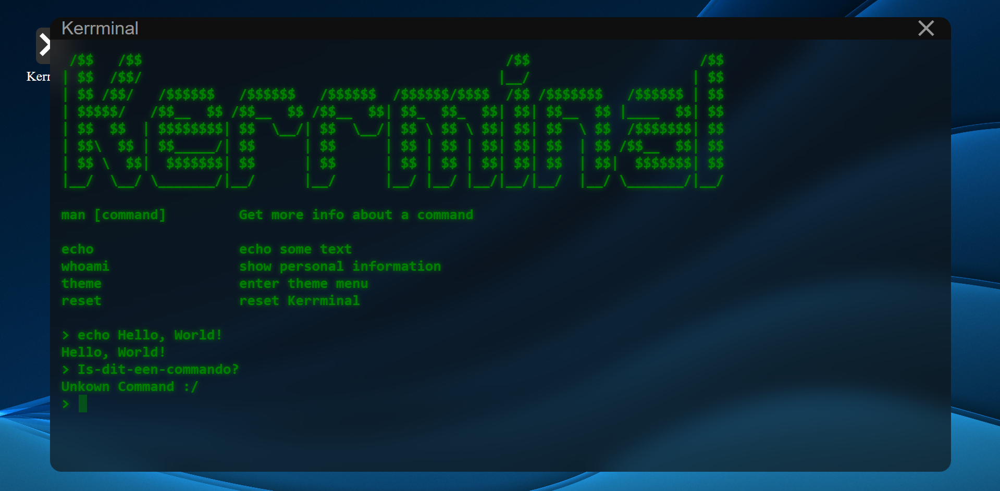
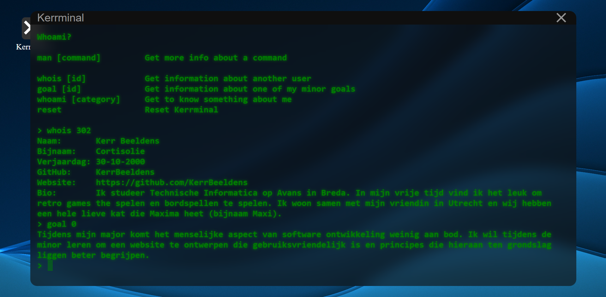
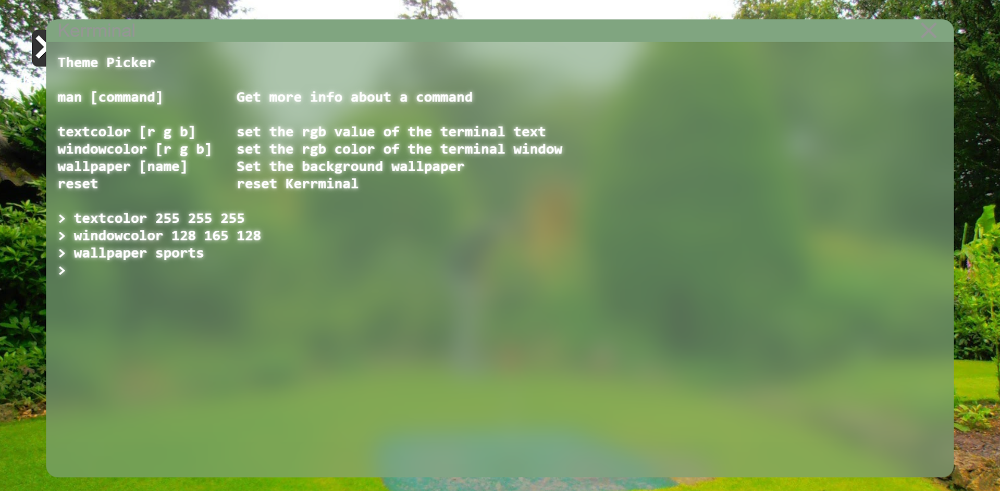
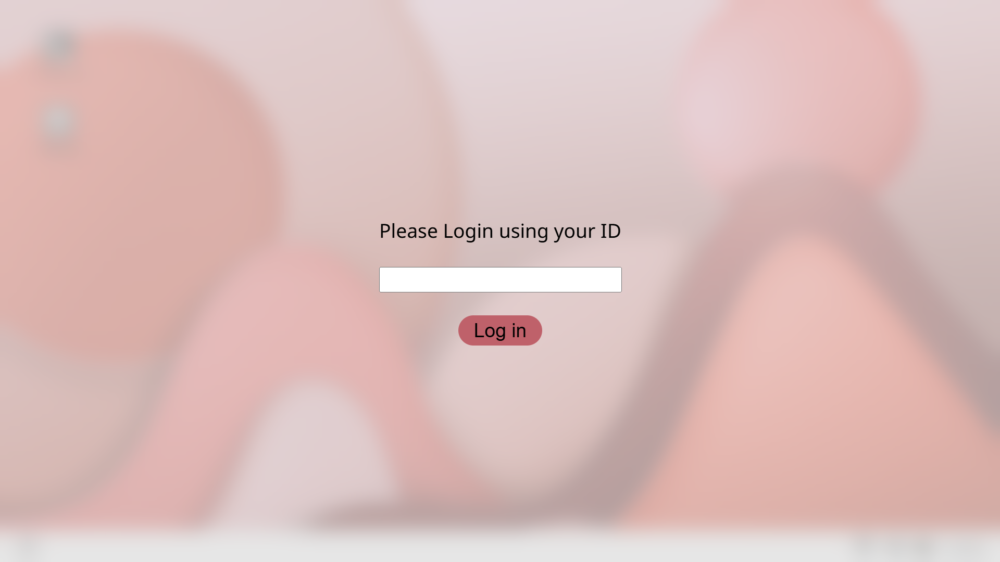
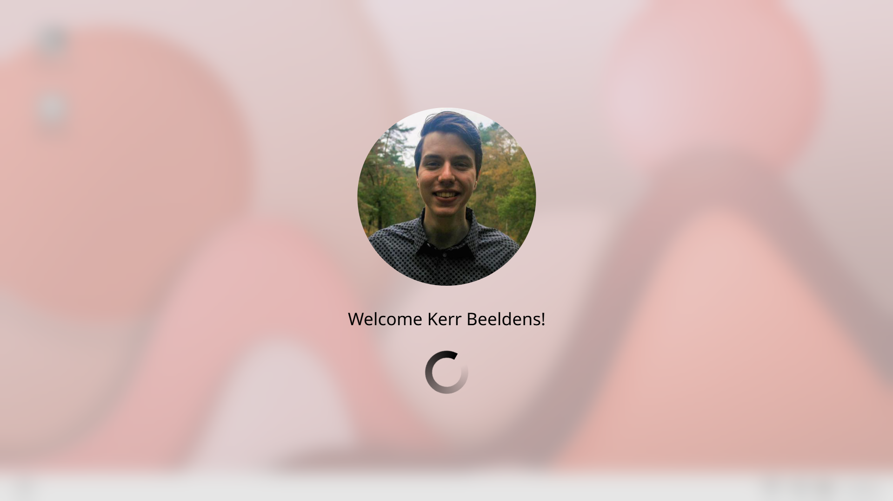
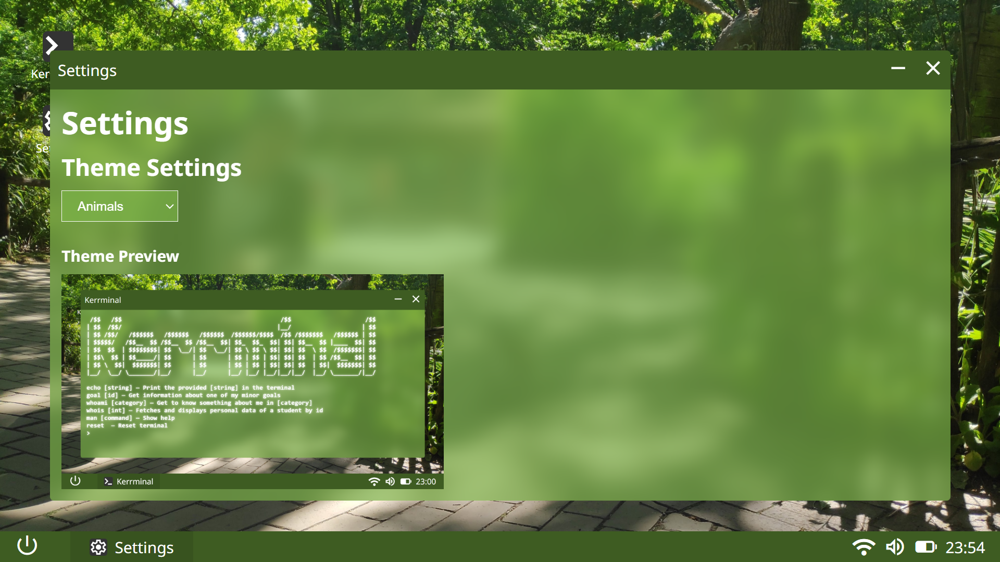

# Kerrminal

Een CLI stijl website om mij (Kerr) te leren kennen. Beschikbaar via [Github Pages](https://kerrbeeldens.github.io/Kerrminal/).

# Dagelijkse check-out 03/02 - 06/02 2026

Hieronder volgt een korte reflectie op de projectvoortgang van elke dag.

## Dinsdag 03/02/2026

Tijdens de eerste dag is het doel van het project besproken, namelijk om een simpele website te bouwen waarmee anderen mij kunnen leren kennen. Ik had al vrij snel het idee om iets te doen met mijn liefde voor Retro Games. Om dit in mijn website te verwerken leek het mij een leuk idee om een retro style game te maken die in een soort verhaal informatie over mij geeft.

Omdat de tijd voor dit project beperkt is, heb ik ervoor gekozen om de scope evenals te beperken. In plaats van dat ik een game maak zoals Tetris, Pokémon of Space Invaders, heb ik ervoor gekozen een text-based adventure game te maken. Een dergelijk spel is eenvoudig uit te breiden, waardoor ik klein kan beginnen en naar behoefte features kan toevoegen. Bij schoolopdrachten leg ik vaak de lat te hoog, dus wil ik mezelf uitdagen om in snel tempo iets simpels op het scherm te krijgen en hier frequent op te itereren, in plaats van een enkel, (te) groot doel na te streven.

Tijdens de check-out van vandaag is er besproken welke leerdoelen ik wil hebben tijdens de minor. Ik heb uiteindelijk de volgende drie gekozen (voor nu):

- Tijdens mijn major komt het menselijke aspect van software ontwikkeling weinig aan bod. Ik wil tijdens de minor leren om een website te ontwerpen die gebruiksvriendelijk is en principes die hieraan ten grondslag liggen beter begrijpen.
- Ik wil leren meer te itereren over mijn werk en minder tijd te spenderen aan kleine details verbeteren. Ik wil dus minder gericht zijn op een groot en ambitieus doel, en me meer richten op een klein prototypes maken en deze uitbreiden tot een steeds complexer geheel.
- Ik verwacht relatief snel vaardiger te worden in JavaScript. Ik hoop echter tijdens de minor vooral stappen te zetten met HTML en in het bijzonder CSS. Concreet zou ik het heel leuk vinden als ik aan het einde van de minor mooie en effectieve microinteracties met animaties te kunnen maken.

Morgen ben ik van plan om een ontwerp te maken en te starten aan het bouwen van de website.

## Woensdag 04/02/2026

Ik heb vandaag stappen gezet met het ontwerpen van mijn website en heb een basis gemaakt voor de achterliggende JavaScript code. Dit duurde een uur of 5. Daarnaast heb ik de themasessie gevolgd over scroll driven animaties. Hier heb ik voor het eerst gewerkt met animaties in CSS, dit had ik namelijk nog niet eerder gedaan.

Morgen ben ik van plan om mijn leerdoelen en thema's te vewerken in de website, zodat ik voor vrijdag een goedwerkende eerste versie heb. Met de tijd die ik over heb wil ik mijn best doen nog wat meer aandacht te vestigen op het ontwerp verbeteren.

## Donderdag 05/02/2026

Vandaag heb ik hard gewerkt aan het functioneel maken van mijn website en javacode. Ik heb inmiddels een werkende terminal stijl applicatie, met enkele commando's om een thema te kunnen selecteren en informatie over studenten via de API op te halen. Dit duurde in totaal een uur of 6. Ik ben vandaag vooral bezig geweest met "busy work" om iets werkende te krijgen voor vrijdag, dus ik heb concreet niet veel geleerd (enkel wat handigheidjes).

Morgen ben ik van plan op de puntjes op de i te zetten en een eerste, werkende versie van mijn applicatie online te krijgen. In het bijzonder wil ik de website een persoonlijke tintje geven.

## Vrijdag 06/02/2026

De website is nu werkend en ik heb de meeste elementen die ik in mijn eerste versie wilde hebben erin verwerkt. Vandaag heb ik vooral gewerkt aan het programmeren van wat commando's om de foto in de achtergrond van mijn "desktop" te kunnen veranderen naar persoonlijke foto's. Ook heb ik wat commando's toegevoegd die hier uitleg bij geven. Dit duurde een paar uur.

Ik heb hiervan geleerd hoe ik CSS direct in Javascript kon veranderen. Dit had ik eerder nog niet gedaan.

Aangezien ik het meeste dat ik wilde toevoegen nu heb, wil ik volgende week maandag de extra eis afwachten en werken aan deze implementeren.

# Voorgang Week 1

Ik ben zeer tevreden met de voortgang die ik heb gemaakt deze week. Mijn hoofddoel was om iteratief te werken en de deadline van vrijdag heeft hier goed bij geholpen. Het is me gelukt om een werkend product neer te zetten.

In de onderstaande figuur is het startscherm van de website te zien. Ik heb zoals eerder aangegeven een terminal look-and-feel gemaakt. Ik wilde oorspronkelijk een text-based advanture maken, maar heb er later voor gekozen om meer te gaan voor een soort desktop omgeving met een terminal applicatie. Dit maakt het iets eenvoudiger om alle eisen te verwerken in de website.

In de figuur is te zien hoe de gebruiker commando's kan invoeren. Met het `echo` commando kan tekst in de terminal worden weergegeven (meer een soort test commando), met het `whoami` commando wordt er genavigeerd naar het `whoami` menu (hier zo meer over). Met het `theme` commando wordt er naar het `theme` menu genavigeerd (ook hier zo meer over). Met het `reset` commando wordt de terminal teruggezet naar de begin staat.

In de figuur hierboven is het `whoami` menu te zien. Met het `whois` commando is het mogelijk om informatie op te vragen uit de API van een specifiek persoon, met het `goal` commando kunnen mijn leerdoelen worden opgehaald en met het `whoami` commando kan wat extra informatie over mij in een specifieke categorie worden opgevraagt.

Als laatste is in de bovenstaande figuur het `theme` menu weergegeven. Hier is het mogelijk om de tekstkleur van de terminal aan te passen met het `textcolor` commando, de kleur van het venster is aan te passen met het `windowcolor` commando en de achtergrond van de "desktop" is te wijzigen met het `wallpaper` commando. De verschillende wallpapers zijn foto's van mij om het geheel een persoonlijk tintje te geven.

# Dagelijkse check-out 09/02 - 12/02 2026

Hieronder volgt een korte reflectie op de projectvoortgang van elke dag.

## Maandag 09/02/2026

Vandaag is de extra eis bekend gemaakt. Het doel was om iets te doen met de data van andere studenten. Dit had ik al in mijn werk verwerkt, maar ik had nog een ander idee hoe ik ook aan deze eis kon voldoen. Ik had het idee om een loginscherm te maken, waarmee de gebruiker kon inloggen alsof hij op een echte computer zat. Dit inloggen gebeurt met diens ID, waarna de naam en profielfoto te zien zijn op het loginscherm terwijl de computer "opstart".

Ik heb vandaag gewerkt met animaties (specifiek transitions) om de login stappen te animeren. Ook heb ik als extraatje het openen en sluiten van het terminal venster geanimeerd. Dit was de eerste keer dat ik had gewerkt met transitions in CSS en ik heb dus geleerd hoe ik dit moet toepassen.

Morgen wil ik mijn volledige code opschonen en de stijling van de website zo ver mogelijk afmaken. Op die manier hoef ik woensdag alleen nog maar kleine details verbeteren en probleempjes oplossen.

## Dinsdag 10/02/2026

Deze dag heb ik vooral gewerkt aan het verder opschonen van de code. Ik wilde graag een settings "applicatie" maken voor mijn website waar de gebruiker thema's kan aanpassen. Ik heb hiervoor een window klasse gemaakt, waardoor het mogelijk is nieuwe applicaties (naast de terminal) te maken die in een venster worden weergegeven. Ik heb op een vergelijkbare manier een shortcut en taskbar klasse gemaakt. Dit duurde een uur of 7.

Ik heb vandaag geleerd om met behulp van een media query de ASCII art van de terminal responsive te maken. Ik had al eerder dit geprobeert via de code, maar met mijn nieuw gestructureerde code is het nu mogelijk om dit op deze manier dynamisch te doen.

Morgen is de laatste dag dat ik aan dit project werk en mijn doel is om het opschonen van de code af te maken, zodat ik thema's kan toevoegen aan het settings venster. Vervolgens wil ik vooral de puntjes op de i zetten als het gaat om de stijling van alles, omdat er nu nog veel kleine slordigheden in de website zitten.

## Woensdag 11/02/2026

Vandaag heb ik de website afgemaakt. Zoals ik gisteren al had aangegeven heb ik vooral gewerkt aan het toevoegen van de thema's en het opschonen van de stijling zodat er (hopelijk) geen grote slordigheden in zitten. Ik heb ook kritisch naar de responsiveness gekeken van de website en dit verbetert waar nodig.

IK heb vandaag geleerd hoe ik verschillende themas kan inladen op mijn website en ik heb geleerd hoe ik op basis van de voorkeuren van de gebruiker een thema kan inladen.

Morgen zal ik mijn werk presenteren :).

# Voorgang Week 2

In week 2 heb ik een nadruk gelegd op stijling, animaties en responsiveness. Ik was bekend met de basisconcepten, maar het toepassen van deze aspecten was nieuw voor mij en was met name waarmee ik in deze opdracht mijn niveau wilde overstijgen. Ik denk dat dit goed gelukt is.

Verder heb ik deze week gewerkt aan de context rondom de terminal applicatie. De terminal applicatie zelf voldeed aan de opdrachtomschrijving, maar mij leek het leuk om de website in zijn geheel op een desktop omgeving te laten lijken qua interactie. Ik heb deze week een toolbar toegevoegd en shortcuts waarmee het mogelijk is om de terminal applicatie te open. Ook werd deze week de tweede eis bekend gemaakt. Ik moest iets doen met de data van mede studenten en ondanks dat dit ik in principe al had verwerkt in mijn terminal applicatie, leek het mij leuk als studenten konden "inloggen" op de desktop omgeving met hun ID.

In de bovenstaande figuur is het loginscherm weergegeven. De gebruiker wordt gevraagd om zijn ID in te voeren. Hierna wordt op basis van deze ID de naam en profielfoto van de gebruiker getoont in een (nep) laadscherm. Hierna komt de gebruiker terecht in de desktop omgeving. Het laadscherm is weergegeven in de onderstaande figuur.

Een laatste functionaliteit die ik heb toegevoegd is een settings applicatie waarmee verschillende themas kunnen worden geselecteerd. Ik had dit vorige week al verwerkt in de terminal, maar ik heb het daar uitgehaald, omdat het mij leuker leek om zelf een paar thema's op te zetten. Daarnaast gaf het de mogelijkheid om een tweede "applicatie" te maken voor de desktop omgeving, zodat de gebruiker nog iets meer het gevoel kreeg binnen zo'n omgeving te werken.

In de bovenstaande figuur is de settings applicatie weergegeven terwijl het alternatieve thema "animals" is geselecteerd. Elk thema stelt als achtergrond een persoonlijke foto in die betrekking heeft op een van de `whoami` commando's. Er zijn een stuk of tien thema's, waaronder een standaard licht en donker thema.

Voor de rest heb ik hard gewerkt aan alles oplever klaar te krijgen, door bronnen te vermelden, bugs uit mijn code te halen en de code netter te schrijven. Tijdens de volgende projecten hoop ik hard te kunnen werken aan mijn leerdoelen. Ook hoop ik dat de langere periode die ik heb voor deze projecten ervoor zorgt dat ik nog net iets meer stil kan staan bij wat ik wil maken en hoe dit eruit komt te zien en hoe ik dit ga implementeren, omdat ik bij dit eerste project wel het gevoel had steeds "door" te moeten.

# Bronnen

Hieronder volgt een bronnenlijst die ik heb gebruikt in mijn code:

- [https://stackoverflow.com/q/55504715](https://stackoverflow.com/q/55504715) voor de layering van het lockscreen.
- [https://css-loaders.com/spinner/](https://css-loaders.com/spinner) voor de spinner op het loginscherm.
- [https://www.w3schools.com/css/css_dropdowns.asp](https://www.w3schools.com/css/css_dropdowns.asp) voor de dropdown op de taskbar.
- [https://developer.mozilla.org/en-US/docs/Web/API/Fetch_API/Using_Fetch](https://developer.mozilla.org/en-US/docs/Web/API/Fetch_API/Using_Fetch) voor het gebruik van de fetch API voor het inladen van data.
- [https://stackoverflow.com/a/39418437](https://stackoverflow.com/a/39418437) Voor het toevoegen van een live clock op het lockscreen en op de taskbar.

Verder heb ik op verschillende plaatsen ChatGPT gebruikt om bugs te vinden in mijn code of om te sparren over de architectuur van mijn code.
